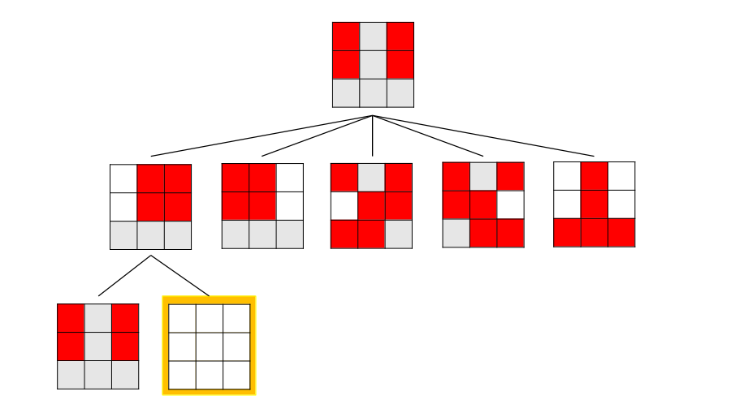

# Exame Epoca Normal 2020

## Exercise 1

### 1.1

State: List of lists (3x3) with values 1 or 0, White or Red

Initial State: 
```
[0, 1, 0]
[0, 1, 0]
[1, 1, 1]
```

Objective:
```
[1, 1, 1]
[1, 1, 1]
[1, 1, 1]
```

Operators:

- ALL: Invert whole board
- TL: Invert the 4 pieces in top left
- TR: Invert the 4 pieces in top right
- BL: Invert the 4 pieces in bottom left
- BR: Invert the 4 pieces in bottom tight

Cost Function: Number of red pieces in the board


### 1.2 

Each state can result into 5 other states. Since each piece has 2 possible states, the number of different states in this problem is `2^9 = 512` states.

### 1.3



### 1.4

```python
def heuristic(state):
    count = 0
    for line in state:
        for cell in line:
            if cell == 0: count += 1

    return count
```

---

## Exercise 2

### 2.1

In the first line the number of locations, `n`, followed by `n` lines with the coordinates `x` and `y` of each place. Example:

```csv
5
1 3
4 5
2 3
0 2
9 2
```

The solution would consist of 3 lists. The first 2 lists represent the ordered indexes of the places to visit for each group, and the last list would be the places that wouldn't be visited.

### 2.2

As a strong restriction we have the sum of the inspection and transport times for each group, which can not be higher than 8 hours. As an optimization we need to maximize the number of visited places. The evaluation function would be the total places visited by the groups.

```python
def evaluate(solution):
    return solution[0].length + solution[1].length
```

### 2.3

Group 1:

- Distance: `(20 + 20) + (10 + 10) + (10) + (10) = 80`
- Transport time: `80 / 20 = 4h`
- Inspection time: `3h`
- Total time: `7h`

Group 2:

- Distance: `(10 + 20) + (10 + 10) + (20 + 10) = 80`
- Transport time: `80 / 20 = 4h`
- Inspection time: `2h`
- Total time: `6h`

The solution is viable as neither of the total times is bigger than 8 hours.

### 2.4

Uma função de vizinhança simples poderia ser: 
- Escolher um número aleatório entre 0 e 2, para escolher se vamos remover um elemento, adicionar um elemento ou trocar um elemento entre brigadas 
    - Se remover, escolher uma brigada aleatória e um elemento aleatório da brigada a remover, apagar esse elemento e adiciona-lo na lista de não visitados 
    - Se adicionar, escolher um elemento aleatório da lista de não visitados, apagar o elemento, escolher uma brigada a adicionar e uma posição aleatória para o colocar e coloca-lo na posição escolhida 
    - Se trocar, escolher um elemento aleatório de cada brigada e troca-los 

Por exemplo:  Solução: `[[ABC], [DE], []] `

Possíveis vizinhos (2.1): 
- `[[BC], [DE], [A]]`
- `[[AC], [DE], [B]]`
- `[[AB], [DE], [C]]`
- `[[ABC], [E], [D]]`
- `[[ABC], [D], [E]]`

Possíveis vizinhos (2.3): 
- `[[DBC], [AE], []]`
- `[[EBC], [DA], []]`
- `[[ADC], [BE], []]`
- `[[AEC], [DB], []]`
- `[[ABD], [CE], []]`
- `[[ABE], [DC], []]`

---

## Exercise 3

### 9


### 10

a)
- A - `10`
- B - `2`
- C - `10`
- D - `<= 5`

b) `O, U, X, Y`

### 11

The minimax algorithm can be used in complex game. As the algorithm analyses the possible moves in depth, it finds a solution very quick, even though it most likely isn't the best. To get a solution in some given time, we only need to interrupt the algorithm and get the best solution at that moment.